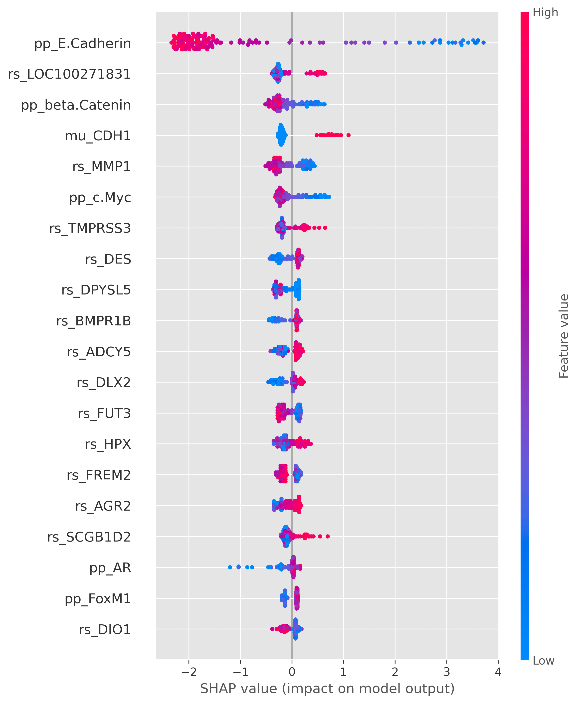

# 🧬 IDC vs ILC Classification Using Gene Expression Data

<p align="center">

**A Comparative Machine Learning Study for Molecular Classification of Infiltrating Ductal Carcinoma and Infiltrating Lobular Carcinoma**

<br>

[](https://www.python.org/)
[](https://scikit-learn.org/)
[](https://xgboost.readthedocs.io/)
[](https://shap.readthedocs.io/)
[](LICENSE)

</p>

---

## 🔬 Abstract

Breast cancer comprises biologically and clinically heterogeneous disease subtypes with distinct molecular characteristics. Among these, **Infiltrating Ductal Carcinoma (IDC)** and **Infiltrating Lobular Carcinoma (ILC)** represent two major histological forms of invasive breast cancer.

This research investigates whether machine learning models can distinguish IDC from ILC using high-dimensional molecular and gene-expression features.

The study presents a comparative evaluation of **Logistic Regression, Random Forest, and XGBoost**, with particular emphasis on predictive performance, feature-selection effects, cross-validation reliability, statistical comparison, and model interpretability.

Beyond predictive classification, the workflow incorporates **SHAP-based explainability, permutation importance, model-derived feature importance, and consensus feature ranking** to investigate molecular features associated with model predictions.

The overall objective is not simply to maximize classification accuracy, but to develop a **reproducible and interpretable computational framework** for studying molecular patterns that may contribute to the distinction between IDC and ILC.

> **Research status:** Experimental research repository. The methodology, results, and biological interpretation may be further refined as the research progresses toward manuscript submission.

---

# 1. 🎯 Research Question

The central research question is:

> **Can machine learning models reliably distinguish Infiltrating Ductal Carcinoma (IDC) from Infiltrating Lobular Carcinoma (ILC) using high-dimensional gene-expression and molecular features, and which features contribute most strongly to these predictions?**

The study additionally investigates:

* How do Logistic Regression, Random Forest, and XGBoost compare?
* How does feature selection affect predictive performance?
* How stable are model performances under stratified cross-validation?
* Are observed differences between models statistically meaningful?
* Which molecular features consistently emerge as important across different interpretation methods?
* What direction of contribution do important features make to XGBoost predictions?

---

# 2. 🧬 IDC vs ILC

Breast cancer is a heterogeneous disease consisting of multiple histological and molecular subtypes.

### Infiltrating Ductal Carcinoma — IDC

IDC originates in the milk ducts and is the most common form of invasive breast carcinoma.

### Infiltrating Lobular Carcinoma — ILC

ILC originates in the milk-producing lobules of the breast and has distinct morphological and molecular characteristics compared with IDC.

Although histopathological examination remains fundamental for diagnosis and classification, molecular data provide an opportunity to investigate patterns that may distinguish these disease entities computationally.

This research therefore frames IDC vs ILC classification as a **binary supervised learning problem** using molecular features.

---

# 3. 🧪 Dataset Description

The analysis uses breast cancer molecular and clinical data containing a large number of molecular variables alongside clinical and pathological attributes.

The primary target variable used for the classification task is:

```text
histological.type
```

The research dataset is high-dimensional, containing substantially more molecular variables than observations. This creates a challenging **high-dimensional, low-sample-size learning setting**, where preprocessing, feature selection, regularization, validation strategy, and leakage prevention are particularly important.

The dataset includes molecular measurements alongside variables representing clinical or pathological characteristics.

### Target

The classification task focuses on:

```text
IDC
vs
ILC
```

The original datasets are **not included in this public repository**.

See [`data/README.md`](data/README.md) for information regarding data availability and responsible data use.

---

# 4. ⚙️ Methodology

The computational workflow is organized into a sequential research pipeline:

```text
                    ┌─────────────────────┐
                    │   Molecular Data    │
                    └──────────┬──────────┘
                               │
                               ▼
                    ┌─────────────────────┐
                    │ Data Verification & │
                    │   Quality Control    │
                    └──────────┬──────────┘
                               │
                               ▼
                    ┌─────────────────────┐
                    │ Exploratory Data    │
                    │      Analysis       │
                    └──────────┬──────────┘
                               │
                               ▼
                    ┌─────────────────────┐
                    │ Stratified Data     │
                    │      Splitting      │
                    └──────────┬──────────┘
                               │
                               ▼
                    ┌─────────────────────┐
                    │ Leakage-Safe        │
                    │ Preprocessing       │
                    └──────────┬──────────┘
                               │
                  ┌────────────┴────────────┐
                  │                         │
                  ▼                         ▼
          ┌──────────────┐         ┌────────────────┐
          │ All Features │         │ Feature Select.│
          └──────┬───────┘         └───────┬────────┘
                 │                         │
                 └────────────┬────────────┘
                              ▼
                 ┌────────────────────────┐
                 │ Logistic Regression    │
                 │ Random Forest           │
                 │ XGBoost                 │
                 └────────────┬───────────┘
                              │
                              ▼
                 ┌────────────────────────┐
                 │ Cross-Validation &     │
                 │ Hyperparameter Search  │
                 └────────────┬───────────┘
                              │
                              ▼
                 ┌────────────────────────┐
                 │ Performance Evaluation │
                 └────────────┬───────────┘
                              │
                    ┌─────────┴─────────┐
                    ▼                   ▼
             Statistical Tests      SHAP Analysis
                    │                   │
                    └─────────┬─────────┘
                              ▼
                 ┌────────────────────────┐
                 │ Consensus Predictive   │
                 │ Feature Analysis       │
                 └────────────┬───────────┘
                              │
                              ▼
                 ┌────────────────────────┐
                 │ Biological             │
                 │ Interpretation         │
                 └────────────────────────┘
```

---

# 5. 🧪 Experimental Design

The study evaluates three machine learning approaches under a common experimental framework.

The analysis includes:

### Data preparation

* Dataset verification
* Target identification
* Numerical feature extraction
* Missing-value handling
* Stratified train-test separation

### Model development

Each model is evaluated using a consistent preprocessing and modeling framework.

### Feature-selection experiments

The study compares:

| Feature configuration | Description                           |
| --------------------- | ------------------------------------- |
| **All Features**      | Full available feature representation |
| **Top 100**           | 100 highest-ranked selected features  |
| **Top 500**           | 500 highest-ranked selected features  |

Feature selection is performed using the training data for the corresponding experiment to reduce information leakage.

---

# 6. 🤖 Machine Learning Models

## Logistic Regression

Logistic Regression provides a regularized linear baseline for binary classification and offers a relatively interpretable model for high-dimensional molecular data.

## Random Forest

Random Forest is an ensemble of decision trees capable of modeling nonlinear relationships and feature interactions.

The implementation incorporates class weighting to account for class-distribution considerations.

## XGBoost

XGBoost is a gradient-boosted decision-tree framework capable of capturing nonlinear relationships and complex feature interactions.

It is additionally used as the primary model for detailed SHAP-based interpretation.

---

# 7. 🧩 Feature-Selection Strategy

Feature selection is particularly important in high-dimensional molecular datasets because thousands of candidate variables can increase computational complexity and the risk of overfitting.

The research compares:

```text
All Features
      │
      ├──────────────► Full feature representation
      │
      ├──────────────► Top 100 features
      │
      └──────────────► Top 500 features
```

The feature-selection experiments investigate whether reducing the dimensionality of the molecular representation improves or maintains predictive performance while potentially producing a more interpretable feature space.

The selected features are subsequently examined through multiple importance and interpretability approaches.

---

# 8. 🔁 Cross-Validation

Model performance is assessed using **Stratified K-Fold Cross-Validation**.

The current analysis uses:

```text
5-fold Stratified Cross-Validation
```

Stratification preserves the relative class distribution across folds.

The evaluation includes:

* Accuracy
* Weighted Precision
* Weighted Recall
* Weighted F1-score
* ROC AUC

Cross-validation provides an estimate of model stability beyond a single train-test split.

---

# 9. 📊 Statistical Testing

Model comparison is not based solely on differences in average performance.

The research additionally investigates whether observed differences between models are statistically meaningful.

Pairwise comparisons of cross-validation performance are performed using the **Wilcoxon signed-rank test**.

Confidence intervals are also estimated for model performance to provide an indication of uncertainty around the observed cross-validation results.

This statistical layer is intended to distinguish potentially meaningful performance differences from differences that may arise from variation across validation folds.

---

# 10. 🧠 SHAP-Based Interpretation

Predictive performance alone does not explain *why* a model makes a particular prediction.

To address this, the research incorporates **SHAP (SHapley Additive exPlanations)** for the XGBoost model.

The SHAP analysis investigates:

* Global feature importance
* Relative contribution of individual features
* Direction of feature contribution
* Distribution of feature effects
* Top predictive features

The repository includes generated SHAP outputs under:

```text
results/shap/
```

and corresponding visualizations under:

```text
results/figures/
```

The interpretability workflow is designed to move from:

```text
Prediction
   ↓
Feature Contribution
   ↓
Feature Ranking
   ↓
Consensus Features
   ↓
Potential Biological Interpretation
```

---

# 11. 🧬 Consensus Predictive-Feature Analysis

A single feature-importance method may produce model-specific rankings.

To reduce dependence on a single interpretation technique, the study combines multiple feature-importance perspectives, including:

* XGBoost feature importance
* Permutation importance
* SHAP importance

These rankings are integrated into a **consensus feature-ranking framework**.

The resulting outputs are available in:

```text
results/feature_selection/consensus_biomarkers.csv
```

This provides a more robust starting point for investigating features that repeatedly appear as important across different analytical perspectives.

> The term "biomarker" is used in the context of computational feature analysis and does not imply clinical validation.

---

# 12. 📈 Key Results

The repository contains the generated experimental outputs required to inspect the study results.

The current analysis provides comparative results across:

* Logistic Regression
* Random Forest
* XGBoost

and across:

* All Features
* Top 100 Features
* Top 500 Features

The repository additionally contains:

* Feature-importance rankings
* Consensus feature rankings
* SHAP feature-importance results
* SHAP directional analysis
* Top-feature tables
* High-resolution interpretation figures

### Result files

```text
results/
├── feature_selection/
│   ├── all_feature_importance.csv
│   ├── consensus_biomarkers.csv
│   ├── feature_selection_experiments.csv
│   └── top20_feature_importance.csv
│
├── shap/
│   ├── shap_feature_importance.csv
│   ├── xgboost_shap_directional_analysis.csv
│   ├── xgboost_shap_feature_importance.csv
│   └── xgboost_top20_shap_features.csv
│
└── figures/
    ├── consensus_biomarkers.png
    ├── shap_bar_plot.png
    ├── shap_beeswarm_plot.png
    ├── shap_summary_plot.png
    └── top20_feature_importance.png
```

> **Important:** Exact headline performance values should be taken from the final validated experimental tables rather than inferred from individual notebook outputs.

---

# 13. 🖼️ Research Figures

## Consensus Predictive Features


The consensus analysis integrates multiple feature-importance perspectives to identify consistently informative molecular features.

---

## SHAP Feature Importance


Global SHAP importance provides a ranked view of features contributing to XGBoost predictions.

---

## SHAP Beeswarm Analysis


The SHAP beeswarm visualization provides information about both feature importance and the direction/magnitude of individual feature contributions.

---

## SHAP Summary



The SHAP summary visualization provides a global view of model behavior across the evaluated observations.

---

## Top Feature Importance


The top-feature analysis highlights the highest-ranked predictive features identified during the feature-importance analysis.

---

# 14. 📁 Repository Structure

```text
IDC-ILC-Gene-Expression-Classification/
│
├── data/
│   └── README.md
│
├── notebooks/
│   ├── 01_IDC_ILC_Exploratory_Analysis.ipynb
│   └── 02_IDC_ILC_Publication_Grade_Analysis.ipynb
│
├── results/
│   ├── feature_selection/
│   │   ├── all_feature_importance.csv
│   │   ├── consensus_biomarkers.csv
│   │   ├── feature_selection_experiments.csv
│   │   └── top20_feature_importance.csv
│   │
│   ├── shap/
│   │   ├── shap_feature_importance.csv
│   │   ├── xgboost_shap_directional_analysis.csv
│   │   ├── xgboost_shap_feature_importance.csv
│   │   └── xgboost_top20_shap_features.csv
│   │
│   ├── figures/
│   │   ├── consensus_biomarkers.png
│   │   ├── shap_bar_plot.png
│   │   ├── shap_beeswarm_plot.png
│   │   ├── shap_summary_plot.png
│   │   └── top20_feature_importance.png
│   │
│   └── README.md
│
├── .gitignore
├── LICENSE
├── requirements.txt
└── README.md
```

---

# 15. ♻️ Reproducibility

The repository is structured to separate:

* Analysis notebooks
* Dataset documentation
* Generated research outputs
* Visualization artifacts
* Environment dependencies

### Install dependencies

```bash
pip install -r requirements.txt
```

### Main analysis workflow

Start with:

```text
notebooks/01_IDC_ILC_Exploratory_Analysis.ipynb
```

followed by:

```text
notebooks/02_IDC_ILC_Publication_Grade_Analysis.ipynb
```

The notebooks document the computational workflow, model development, feature-selection experiments, evaluation, statistical analysis, and interpretability procedures.

---

# 16. 🔐 Data Availability

The underlying research datasets are **not included in this public repository**.

This decision is intentional and helps avoid inappropriate redistribution of datasets that may have their own licensing, attribution, privacy, or data-use requirements.

Researchers interested in reproducing the study should obtain the relevant dataset through its authorized source and comply with all applicable terms.

See:

[`data/README.md`](data/README.md)

for additional information.

---

# 17. ⚠️ Limitations

Several limitations should be considered when interpreting the findings.

### High-dimensional feature space

The molecular feature space is substantially larger than the number of observations, increasing the risk of overfitting and making robust validation essential.

### Dataset size

The available sample size limits the extent to which the results can be generalized to independent populations.

### External validation

The current repository does not establish performance on an independent external cohort.

### Biological validation

Computationally important features should not automatically be interpreted as clinically validated biomarkers.

### Model dependence

Feature importance can depend on the underlying model and interpretation methodology. Consensus analysis helps address this issue but does not eliminate it.

### Clinical applicability

The models have not been validated as clinical diagnostic tools and should not be interpreted as such.

---

# 18. 🔭 Future Work

Potential extensions of the research include:

* Independent external validation
* Larger multi-cohort datasets
* Nested cross-validation
* More rigorous feature-selection stability analysis
* Additional machine learning and deep learning approaches
* Multi-omics integration
* Gene-set and pathway-level analysis
* Independent biological validation of candidate features
* Explainability stability analysis
* Calibration and uncertainty analysis
* Prospective clinical evaluation
* Collaboration with domain experts in oncology and molecular biology

The long-term objective is to move from computational classification toward a more robust understanding of the molecular differences between IDC and ILC.

---

# 19. 📚 Citation

If you use this repository, methodology, or derived computational outputs in academic work, please cite the repository.

### BibTeX

```bibtex
@software{mirani_idc_ilc_classification,
  author  = {Vrund Mirani},
  title   = {IDC vs ILC Classification Using Gene Expression Data},
  year    = {2026},
  publisher = {GitHub},
  url     = {https://github.com/VrundMirani/IDC-ILC-Gene-Expression-Classification}
}
```

A formal publication citation will be added when the associated research manuscript is finalized and published.

---

# 20. 👨‍🔬 Author

## Vrund Mirani

**BTech Computer Science and Engineering (Data Science)**

Research interests include:

* Machine Learning
* Artificial Intelligence
* Data Science
* Computational Biology
* Biomedical Data Analysis
* Explainable AI

This repository represents an ongoing effort to apply machine learning and interpretable computational methods to biomedical research questions.

---

## 📜 License

This project is released under the **MIT License**.

See [`LICENSE`](LICENSE) for details.

---

## ⚕️ Research Disclaimer

This repository is intended for **research and educational purposes**.

The machine learning models, feature rankings, SHAP analyses, and computational findings presented here are **not clinical diagnostic systems** and should not be used to make medical diagnoses, treatment decisions, or other clinical decisions.

Computationally identified features should be independently validated before any biological or clinical interpretation.

---

<p align="center">

**🧬 Machine Learning × Computational Biology × Explainable AI**

</p>
