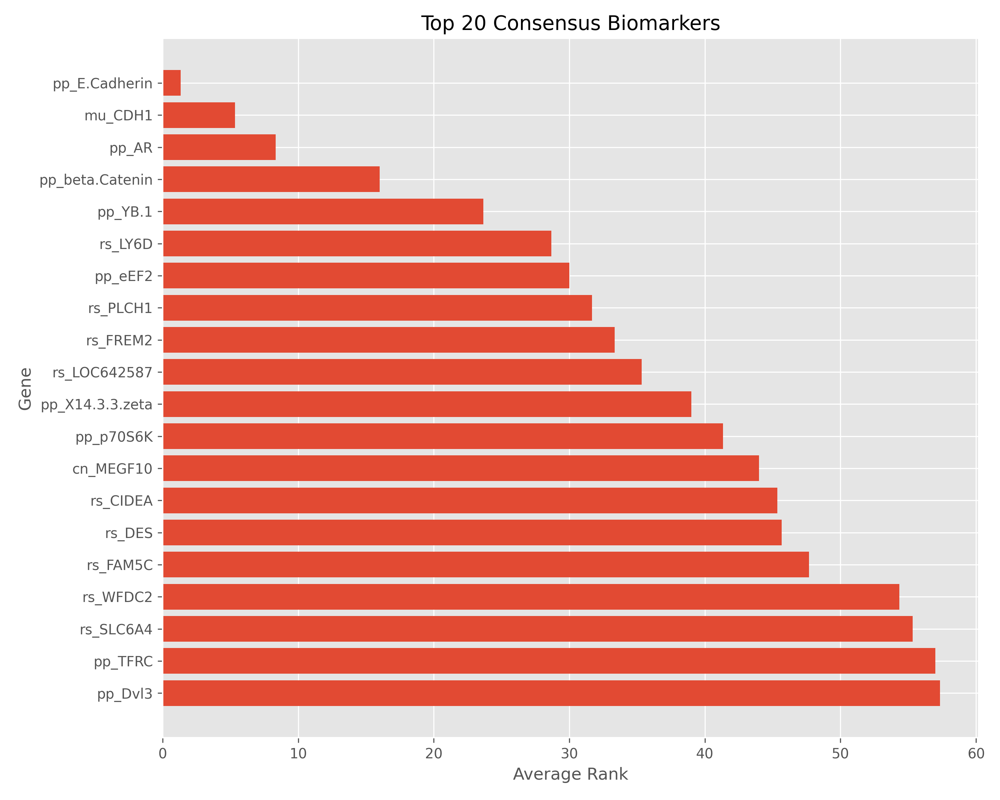
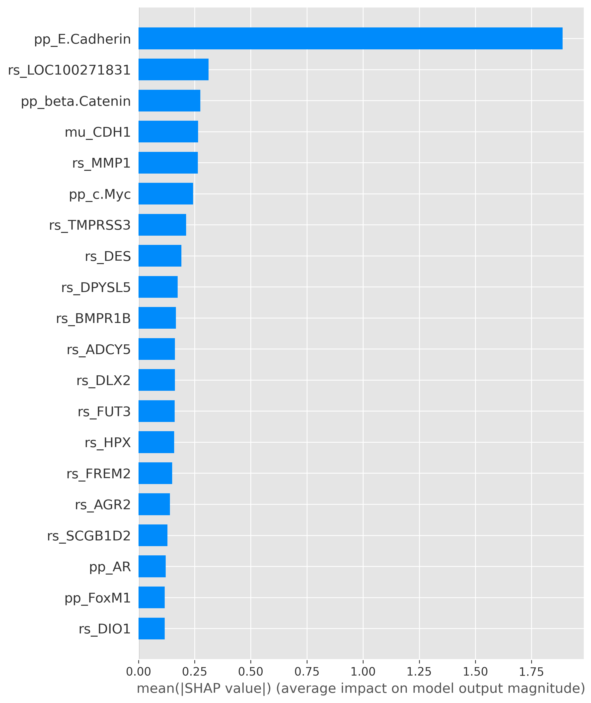
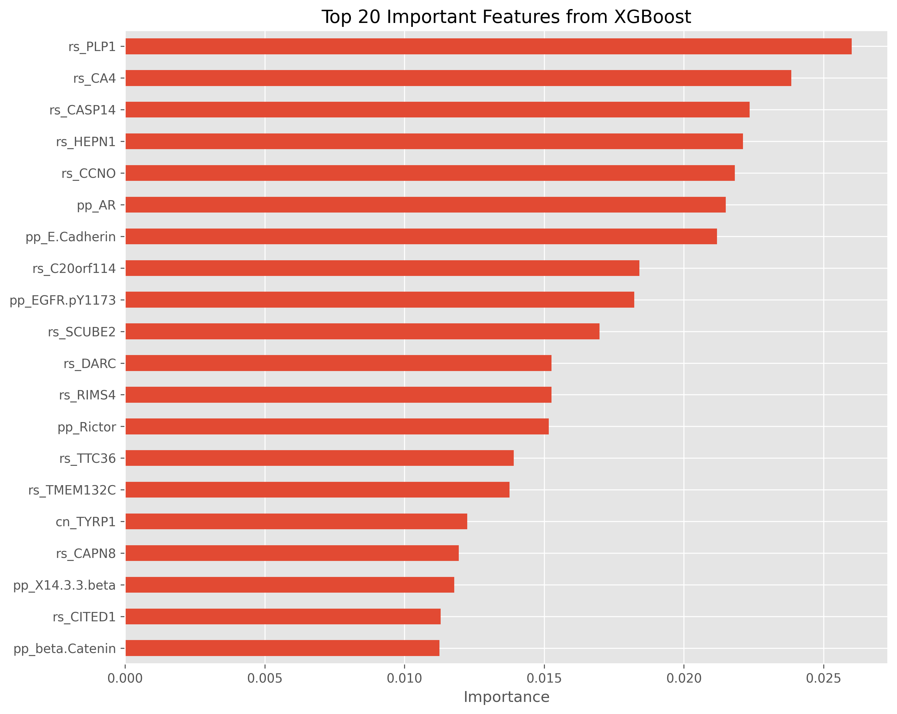

# 🧬 IDC vs ILC Classification Using Gene Expression Data

### Comparative Machine Learning and Explainable AI Analysis of Infiltrating Ductal Carcinoma and Infiltrating Lobular Carcinoma

<p align="center">
  <a href="https://www.python.org/">
    
  </a>
  <a href="https://scikit-learn.org/">
    
  </a>
  <a href="https://xgboost.readthedocs.io/">
    
  </a>
  <a href="https://shap.readthedocs.io/">
    
  </a>
  <a href="LICENSE">
    
  </a>
</p>

<p align="center">
  <strong>AI Healthcare Research · Computational Oncology · Machine Learning · Explainable AI</strong>
</p>

---

## 🔬 Research Overview

Breast cancer is molecularly heterogeneous, and **Infiltrating Ductal Carcinoma (IDC)** and **Infiltrating Lobular Carcinoma (ILC)** exhibit distinct biological characteristics.

This study investigates whether **high-dimensional gene-expression and molecular features** can be used to distinguish IDC from ILC through machine learning.

Three complementary models are evaluated:

**Logistic Regression · Random Forest · XGBoost**

The study goes beyond predictive performance by combining **cross-validation, statistical testing, feature-selection analysis, SHAP explainability, permutation importance, and consensus feature ranking**.

> **Research objective:** Develop a reproducible and interpretable computational framework for studying molecular patterns associated with IDC vs ILC classification.

---

## 🎯 Research Question

> **Can machine learning reliably distinguish IDC from ILC using high-dimensional molecular features, and which features contribute most strongly to the predictions?**

The study evaluates four closely related questions:

* Which model provides the strongest predictive performance?
* How does feature selection affect classification?
* How stable are model performances across validation folds?
* Which molecular features consistently emerge as important across interpretation methods?

---

## 🧬 IDC vs ILC

**IDC** originates primarily from the breast ducts, while **ILC** originates from the lobular tissue of the breast.

Their biological and morphological differences make IDC vs ILC classification an important computational research problem for investigating whether molecular data contain discriminative patterns.

In this study, IDC vs ILC is formulated as a **binary supervised-learning problem** with:

```text
Target: histological.type

IDC  ↔  ILC
```

---

## 🧪 Dataset

The study uses a **high-dimensional breast cancer molecular dataset** containing gene-expression and related molecular/clinical variables.

The target variable is:

```text
histological.type
```

The feature space is substantially larger than the number of available observations, creating a **high-dimensional, low-sample-size setting** that requires careful preprocessing, feature selection, regularization, and validation.

🔒 **Raw datasets are intentionally excluded from this repository.**

See [`data/README.md`](data/README.md) for data-availability information.

---

# ⚙️ Methodological Framework

```text
Molecular Data
      ↓
Quality Control & EDA
      ↓
Stratified Train/Test Separation
      ↓
Leakage-Safe Preprocessing
      ↓
Feature Selection
      ↓
┌─────────────────────────────┐
│ Logistic Regression         │
│ Random Forest               │
│ XGBoost                     │
└──────────────┬──────────────┘
               ↓
     5-Fold Stratified CV
               ↓
 Performance + Statistical Tests
               ↓
       SHAP Interpretation
               ↓
 Consensus Feature Ranking
               ↓
   Biological Interpretation
```

---

## 🤖 Models

| Model                   | Role                                                         |
| ----------------------- | ------------------------------------------------------------ |
| **Logistic Regression** | Regularized linear baseline                                  |
| **Random Forest**       | Nonlinear ensemble model                                     |
| **XGBoost**             | Gradient-boosted tree model and primary explainability model |

The models are evaluated under a common preprocessing and validation framework.

---

## 🧩 Feature Selection

To study the effect of dimensionality reduction, the experiments compare:

| Configuration    | Description                                                |
| ---------------- | ---------------------------------------------------------- |
| **All Features** | Full feature representation                                |
| **Top 100**      | Reduced representation using the top 100 selected features |
| **Top 500**      | Reduced representation using the top 500 selected features |

Feature selection is performed using the training data within the corresponding experiment to reduce information leakage.

---

## 📊 Evaluation & Statistical Reliability

Model performance is evaluated using:

**Accuracy · Precision · Recall · F1-score · ROC AUC**

The study uses:

**5-fold Stratified Cross-Validation**

and incorporates **Wilcoxon signed-rank tests** for pairwise comparison of cross-validation performance, together with confidence-interval estimation.

This allows the analysis to consider not only **which model scores higher**, but also **how stable and statistically defensible those differences are**.

---

## 🧠 Explainable AI

Predictive performance alone does not reveal why a model makes its decisions.

For XGBoost, the study therefore applies **SHAP (SHapley Additive exPlanations)** to investigate:

* Global feature importance
* Feature contribution direction
* Individual feature effects
* Top predictive features

Feature importance is additionally examined through **permutation importance** and XGBoost-derived importance.

These complementary perspectives are integrated into a **consensus feature-ranking analysis**.

> Computationally important features should not be interpreted as clinically validated biomarkers without independent biological and clinical validation.

---

# 📈 Research Outputs

Selected outputs are available in [`results/`](results/):

### Feature Selection

* [`consensus_biomarkers.csv`](results/feature_selection/consensus_biomarkers.csv)
* [`all_feature_importance.csv`](results/feature_selection/all_feature_importance.csv)
* [`feature_selection_experiments.csv`](results/feature_selection/feature_selection_experiments.csv)

### SHAP Analysis

* [`shap_feature_importance.csv`](results/shap/shap_feature_importance.csv)
* [`xgboost_shap_directional_analysis.csv`](results/shap/xgboost_shap_directional_analysis.csv)
* [`xgboost_top20_shap_features.csv`](results/shap/xgboost_top20_shap_features.csv)

---

# 🖼️ Key Research Figures

### Consensus Feature Analysis



### SHAP Feature Importance



### SHAP Beeswarm


### Top Feature Importance



---

# 📁 Repository Structure

```text
IDC-ILC-Gene-Expression-Classification/
│
├── data/
│   └── README.md
│
├── notebooks/
│   ├── 01_IDC_ILC_Exploratory_Analysis.ipynb
│   └── 02_IDC_ILC_Publication_Grade_Analysis.ipynb
│
├── results/
│   ├── feature_selection/
│   ├── shap/
│   ├── figures/
│   └── README.md
│
├── .gitignore
├── LICENSE
└── requirements.txt
```

---

# ♻️ Reproducibility

Install the required dependencies:

```bash
pip install -r requirements.txt
```

Run the notebooks in sequence:

```text
01_IDC_ILC_Exploratory_Analysis.ipynb
                    ↓
02_IDC_ILC_Publication_Grade_Analysis.ipynb
```

The notebooks document the data-processing, modeling, evaluation, statistical, and interpretability workflow.

---

# ⚠️ Limitations

The current study has several important limitations:

* High-dimensional feature space relative to sample size
* No independent external-cohort validation
* Computational feature importance does not establish biological causality
* Results require validation on additional datasets before broader generalization
* The models are research prototypes, not clinical diagnostic systems

---

# 🔭 Future Research

Future work may investigate:

**External validation · Multi-cohort analysis · Nested validation · Multi-omics integration · Pathway-level analysis · Feature-selection stability · Explainability stability · Independent biological validation**

The broader goal is to combine **AI, molecular data, and interpretable machine learning** to support deeper computational investigation of breast cancer biology.

---

# 📚 Citation

```bibtex
@software{mirani_idc_ilc_classification,
  author    = {Vrund Mirani},
  title     = {IDC vs ILC Classification Using Gene Expression Data},
  year      = {2026},
  publisher = {GitHub},
  url       = {https://github.com/VrundMirani/IDC-ILC-Gene-Expression-Classification}
}
```

A formal publication citation will be added when the associated manuscript is finalized and published.

---

# 👨‍🔬 About the Researcher

## Vrund Mirani

**AI Healthcare Researcher · BTech CSE (Data Science)**

Working at the intersection of:

**Artificial Intelligence · Machine Learning · Computational Biology · Healthcare Data · Explainable AI**

This research explores how interpretable machine-learning methods can be applied to molecular and biomedical datasets to investigate clinically relevant research questions.

---

## ⚕️ Research Disclaimer

This repository is intended for **research and educational purposes**.

The models, feature rankings, SHAP analyses, and findings presented here are **not clinical diagnostic systems** and should not be used for medical diagnosis or treatment decisions.

---

<p align="center">

### 🧬 AI × Healthcare × Computational Biology

**Building interpretable AI systems for biomedical research.**

</p>
